#  Supply Chain Dependency Confusion Lab - Nexus Repository OSS

A self-hosted lab reproducing **Dependency Confusion**, the supply-chain attack where a package manager installs a public, attacker-controlled package instead of an organization's private package of the same name. Built on **Sonatype Nexus Repository OSS**, covering both **npm** and **pip**, with two candidate defenses tested and compared.

## Stack

- Sonatype Nexus Repository OSS 3.68, via Docker Compose
- npm / Node.js and pip / Python as attack and defense clients
- Bash + Nexus REST API for repository provisioning
- Git (SSH-based push, history sanitization)

## Architecture

Most Dependency Confusion write-ups use two isolated registries and switch the client between them. This lab instead reproduces the topology that actually causes the vulnerability in real organizations: a **Group Repository** that transparently aggregates a private registry and a public one behind a single URL.


A group repository resolves a package name by combining metadata from every member and returning the **highest version found** - with no notion of which source is trusted. That behavior, not a misconfiguration, is the root cause reproduced here.

**Repositories provisioned** (via `nexus-setup/init-repos.sh`, using the REST API):

| Repo | Type | Format |
|---|---|---|
| `npm-internal-hosted` | hosted | npm |
| `npm-public-sim-hosted` | hosted | npm |
| `npm-group` | group | npm |
| `pypi-internal-hosted` | hosted | pypi |
| `pypi-public-sim-hosted` | hosted | pypi |
| `pypi-group` | group | pypi |

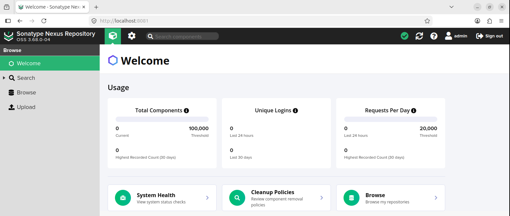
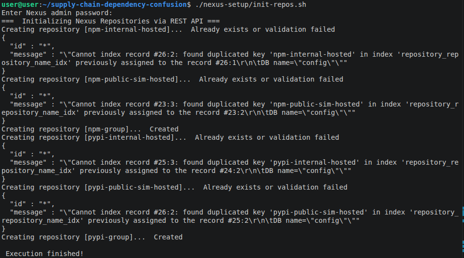
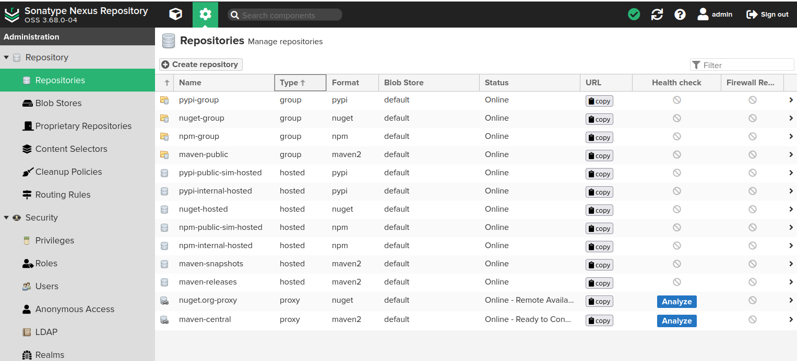
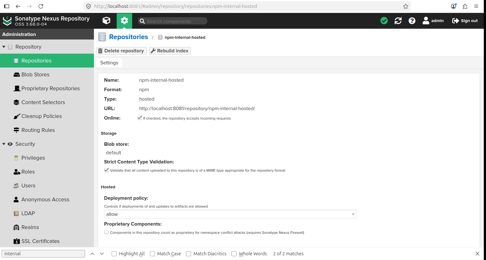

## The Attack

**Setup:**
- Legitimate package `internal-utils@1.0.0` published to `npm-internal-hosted`.
- Imposter package `internal-utils@9.9.9` (same name, higher version) published to `npm-public-sim-hosted`, simulating an attacker who registered the internal package name on the public registry.
- Client `.npmrc` in `vulnerable-project/npm-demo` points directly at `npm-group` - the default, "convenient" configuration most developers actually use.

**Result:** `npm install` resolves the package through the group repository, sees both versions, and installs `9.9.9` - the imposter. Confirmed by arbitrary code execution from the installed package. The same class of vulnerability was reproduced for pip against `pypi-internal-hosted`.

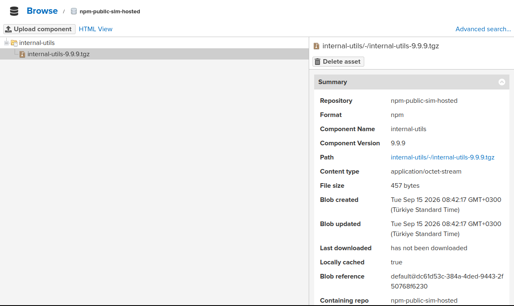
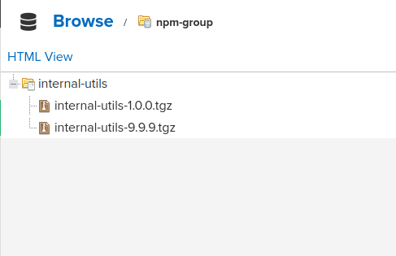
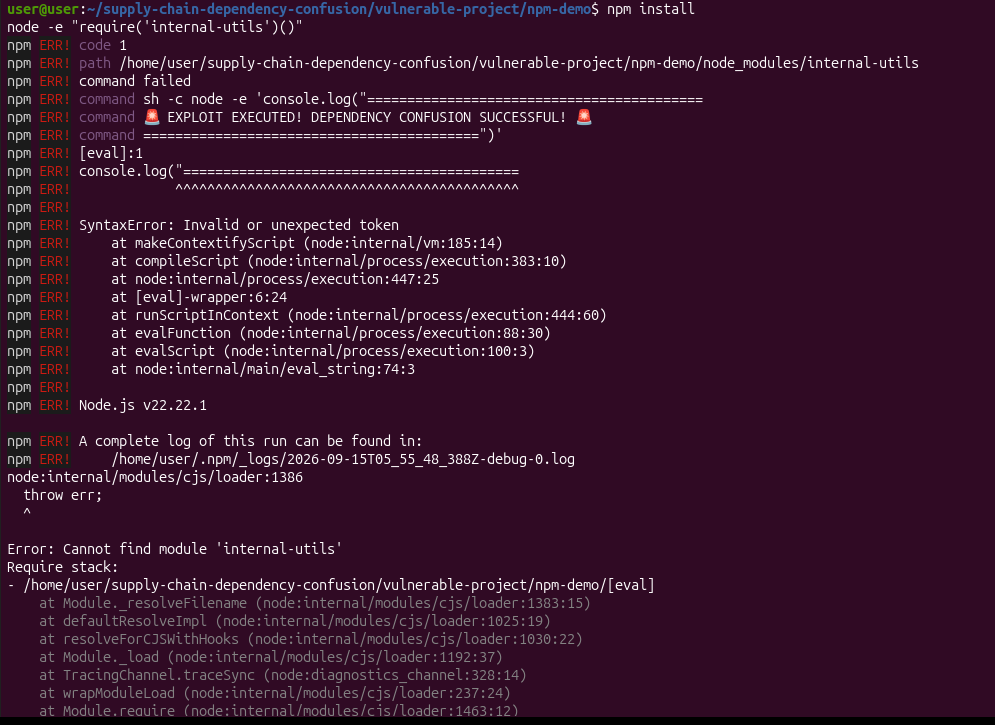

## Defenses Tested

### ✅ Fix A - Client-Side Scoping (effective)

- **npm:** internal package renamed to a scoped package, `@yourorg/internal-utils`. `.npmrc` routes the `@yourorg` scope directly to `npm-internal-hosted`, bypassing the group entirely.
- **pip:** `--extra-index-url` (searches every configured index, returns the highest version - the same vulnerable behavior) replaced with a hard `--index-url` pointed only at `pypi-internal-hosted`.

Result: the protected client resolves the trusted internal `1.0.0` in both ecosystems, even with the imposter package still live on the public-sim registry.

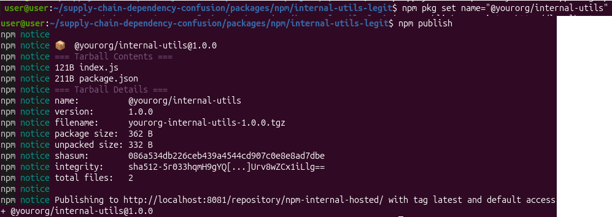
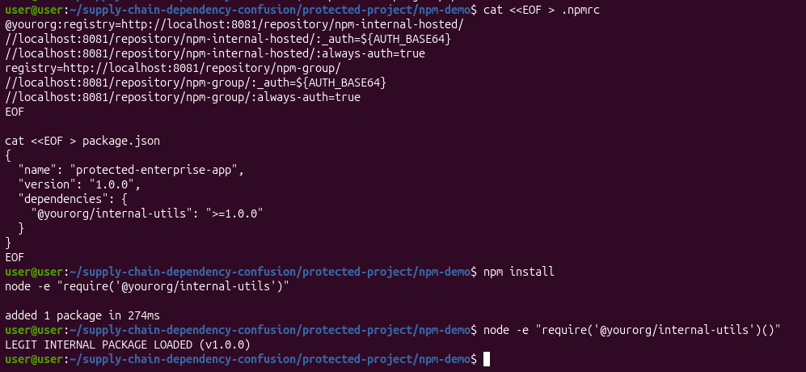
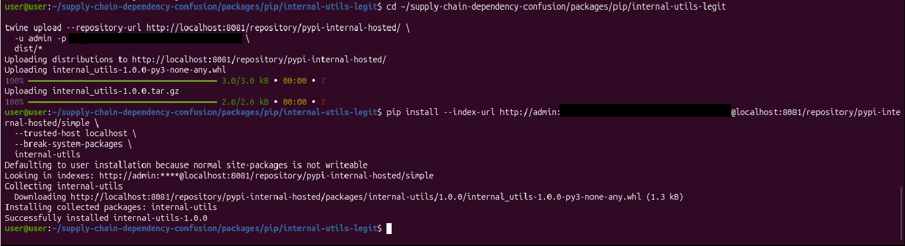

### ⚠️ Fix B - Server-Side Routing Rules (partial - see finding below)

Nexus Routing Rules were configured to block requests matching the `internal-.*` pattern, applied at the server level.

## Key Finding

**Nexus Routing Rules only apply to traffic passing through proxy repositories.** When the conflict occurs *inside a group repository between two hosted repositories* - the exact topology used here, and a common one in real Nexus deployments - Routing Rules do not intervene, and the imposter can still win.

This means Routing Rules, often documented as a straightforward server-side fix for Dependency Confusion, silently do nothing in a hosted+hosted group setup. In that configuration, **client-side scoping is not one of two options - it's the only effective control.**

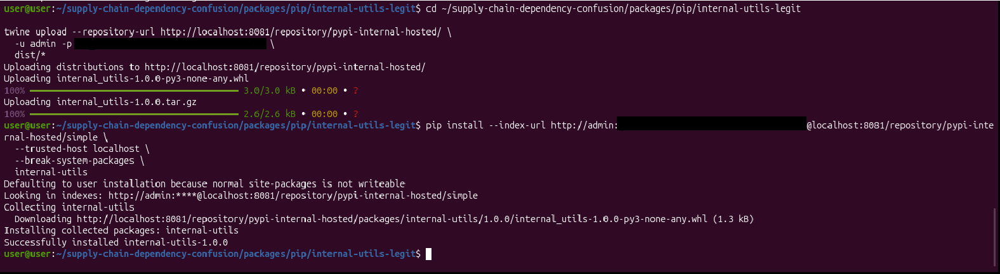

## Running It

```bash
docker compose up -d
./nexus-setup/init-repos.sh
```

Then compare `vulnerable-project/npm-demo/.npmrc` against `protected-project/npm-demo/.npmrc` - the entire fix is visible in that one file. Full analysis in `docs/findings.md`.

## Notes on Setup

- `.gitignore` excludes `node_modules`, build caches, and compiled Python artifacts (`.whl`, `.tar.gz`, `*.egg-info`).
- Base64 auth tokens accidentally committed in `.npmrc` were removed from git history via `git commit --amend` before the initial push.
- Push to GitHub is configured over SSH.

## What This Demonstrates

- Designing a vulnerable environment that matches real-world tooling (Nexus Group Repositories), not a simplified stand-in
- Reproducing a known CVE-class supply-chain attack end-to-end, across two package ecosystems
- Evaluating multiple defenses empirically rather than assuming documentation is complete - and finding where one of them breaks down
- Clean repo hygiene: secret scrubbing from git history, `.gitignore` discipline, reproducible setup via API automation
